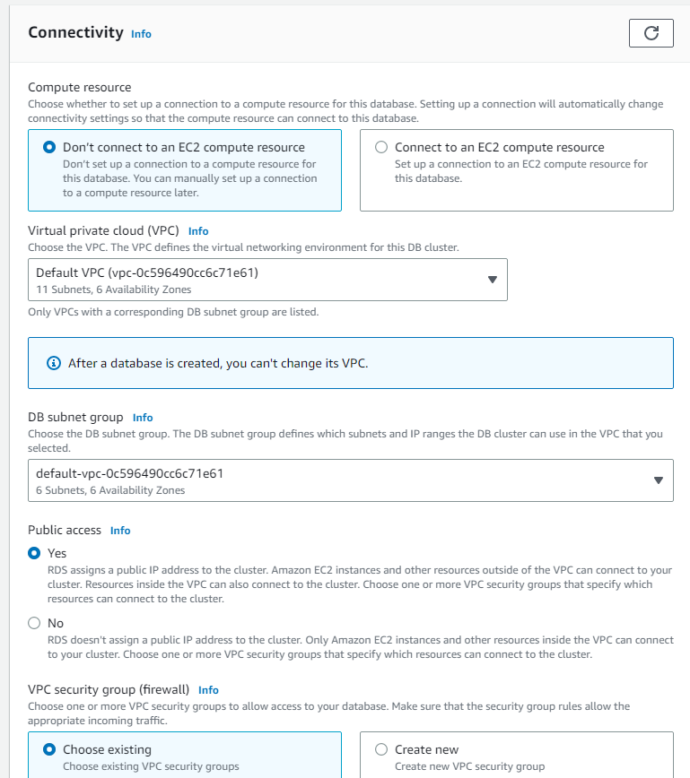

# Topicos Especiales de Telematica - Reto 4 - Julián David Bueno Londoño
## Paso 1 - Creación del RDS
Se accede al servicio RDS de AWS.  
Se crea la base de datos RDS con MySQL

Se revisa que la opcion de "publicly accessible" este checada

Se guarda el Endpoint y el puerto de la base de datos

## Paso 2 - Creación del EFS
Se accede al servicio EFS de AWS.  
Se crea el Elastic File System

Se guarda el DNS Name

## Paso 3 - Creación del Moodle
- Se accede al servicio EC2 de AWS.  
- Se crea una nueva instancia de Ubuntu con puertos 22 y 80 abiertos.

- Se accede a la instancia Ubuntu creada por medio de ssh.  
- Se clona el repositorio `git clone https://github.com/jdbuenol/TET-Reto4.git`  
- Se accede al repositorio `cd TET-Reto4`  
- Se instala las EFS tools de Amazon `sudo sh installEFSTools.sh`  
- Se edita el archivo `mount.sh` cambiando la variable nfs por el DNS name del EFS  
- Se monta el EFS en la instancia de ubuntu `sudo sh mount.sh`  
- Se instala php y los paquetes necesarios para moodle `sudo sh installPhp.sh`
- Se instala Apache2 y se pone a correr el Moodle `sudo sh startMoodle.sh`
- Poner el DNS apuntando a la IP publica de la instancia de Ubuntu

## Paso 4 - Configuración del Moodle
- Se accede a la ip publica con url moodle `http://34.201.70.101/moodle`

- Se asigna el directorio del EFS como Data Directory en mi caso `/moodle_data`

- Se elige MySQL como el database driver

- Se crea una conexion entre la base de datos de RDS con la instancia de Ubuntu

- Se llena la configuración de la base de datos con los datos del RDS

- Se acepta el copyright y se espera a que la instalación de Moodle haga efecto

- Se llenan los datos generales

- Se llenan los datos del sitio

- Se registra el sitio

- Se visualiza el sitio web ya funcional

- Se edita el archivo '/var/www/html/moodle/php.config' modificando la variable wwwroot cambiando la ip por el dominio

## Paso 5 - Creación de la AMI 
- Se selecciona la instancia de Ubuntu y se crea la imagen

## Paso 6 - Creación del LoadBalancer

- Se crea una LaunchTemplate usando la AMI creada en el paso anterior

- Se crea un TargetGroup

- Se crea un Application LoadBalancer

- Se guarda el DNS Name del LoadBalancer

- Se crea un autoscaling group

- Se utiliza el comando dig con el DNS Name del LoadBalancer para encontrar las ips del LoadBalancer

- Se actualiza el DNS con una ip del LoadBalancer

- Finalmente se accede al dominio con la url /moodle para apreciar el sitio web
